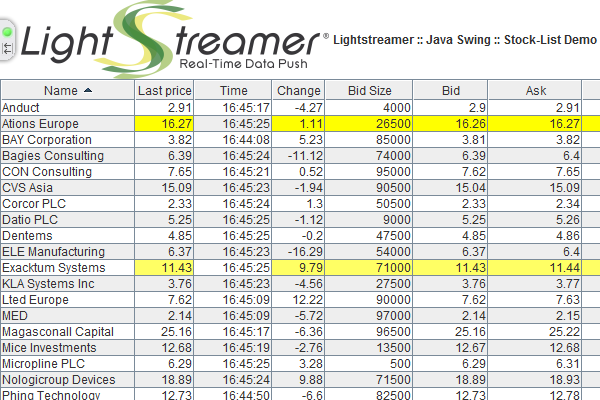

# Lightstreamer - Basic Stock-List Demo - Java SE (Swing) Client

This project contains an example of a **Java Swing application** that employs the 
[Lightstreamer Java SE client library](http://docs.lightstreamer.com/api/ls-javase-client/latest/).

## Live Demo

[](http://demos.lightstreamer.com/JavaSE_Swing_StockListDemo/javase-uni-stocklist-demo.zip)

###[ View live demo](http://demos.lightstreamer.com/JavaSE_Swing_StockListDemo/javase-uni-stocklist-demo.zip)

(download javase-stocklist-demo.zip; unzip it; launch `start_demo.bat` on Windows or `start_demo.sh` on Linux)
*To run this demo, you must have Java installed* . If you don't have Java already installed, please download it from [here] (https://www.java.com/en/download/).


## Details

This is a Java Swing version of the [Stock-List Demos](https://github.com/Weswit/Lightstreamer-example-StockList-client-javascript), where thirty items are subscribed to.


This app uses the **Java SE Client API for Lightstreamer** to handle the communications with Lightstreamer Server. A simple user interface is implemented to display the real-time data received from Lightstreamer Server.

You can sort on any columns and drag the columns around.

This application uses the LightstreamerClient class to connect to Lightstreamer Server and subscribe to the 30 items. 
The client library offers auto-reconnection and auto-resubscription logic out of the box. The status of the connection can be seen on the top left corener of the demo.
Java Swing classes are used to display the real-time updates received from Lightstreamer Server. The application code implements a cell highlighting mechanism, too.


## Install

If you want to install a version of this demo pointing to your local Lightstreamer Server, follow these steps:

* Note that, as prerequisite, the [Lightstreamer - Stock- List Demo - Java Adapter](https://github.com/Weswit/Lightstreamer-example-Stocklist-adapter-java) has to be deployed on your local Lightstreamer Server instance. Please check out that project and follow the installation instructions provided with it.
* Launch Lightstreamer Server.
* Download the `deploy.zip` file, which you can find in the latest [deploy release](https://github.com/Weswit/Lightstreamer-example-StockList-client-java/releases) of this project and extract the `javase-uni-stocklist-demo` folder.
* Launch `start_demo.bat` on Windows or `start_demo.sh` on Linux (please note that the demo tries to connect to http://localhost:8080).

## Build

To build your own version of `java_sld.jar`, instead of using the one provided in the deploy.zip file from the Install section above, you have two options:
either use [Maven](https://maven.apache.org/) (or other build tools) to take care of dependencies and building (recommended) or gather the necessary jars yourself and build it manually. 

###Maven

You can easily build and run this application using Maven through the pom.xml file located in the root folder of this project. As an alternative, you can use an alternative build tool (e.g. Gradle, Ivy, etc.) by converting the provided pom.xml file.

Assuming Maven is installed and available in your path you can build the demo by running
```sh
mvn package
```
 
You can also run the application with the following command
```sh
mvn exec:java -Dexec.args="http://push.lightstreamer.com"
```
the arguments in the above command is obviously the target Lightstreamer server, it can be changed to point
to your own server provided that [Lightstreamer - Stock- List Demo - Java Adapter](https://github.com/Weswit/Lightstreamer-example-Stocklist-adapter-java)
is installed on it (the [LiteralBasedProvider](https://github.com/Weswit/Lightstreamer-example-ReusableMetadata-adapter-java) is also needed, 
but it is already provided by Lightstreamer server.)

###Manual

Follow these steps:

Please consider that this example is comprised of the following folders:
* /src<br>
  Contains the sources to build the java application from the java compiler and its embedded images.

* /lib<br>
  Drop here the `ls-java-client-*.jar` from the Lighstreamer SDK for Java SE Clients, to be used for the build process and execution together with all its required libraries. You can discover the required libraries and their dependencies by looking at the provided pom.xml file. Note that dependencies are only required to run the application; the only compile requirement is the Lightstreamer Java client itself.

* /bin<br>
  Drop here the application jar, as compiled from the provided source files. 

Example build commands:
```sh
 >javac -source 1.7 -target 1.7 -nowarn -g -classpath lib/ls-javase-client.jar -sourcepath src/javasedemo -d tmp_classes src/javasedemo/swing/StockListDemo.java
 
 >jar cvf java_sld.jar -C tmp_classes javasedemo
```

A couple of shell/batch files that can be used to run the demo:
* batch command:

```cmd
@echo off

set JAVA_HOME=C:\Program Files\Java\jdk1.7.0
set CONF=http://localhost:8080

call "%JAVA_HOME%\bin\java.exe" -cp "java_sld.jar";"../lib/*" javasedemo.swing.StockListDemo %CONF%
pause
```

* shell command:

```sh
#! /bin/sh

JAVA_HOME=/usr/jdk1.7.0
CONF="http://localhost:8080"

exec $JAVA_HOME/bin/java -cp "java_sld.jar:../lib/*" javasedemo.swing.StockListDemo $CONF
```

Those scripts are ready to run the client against the default Lightstreamer configuration but it may be necessary to change the reference to the java process inside them.

The example requires that the [QUOTE_ADAPTER](https://github.com/Weswit/Lightstreamer-example-Stocklist-adapter-java) has to be deployed in your local Lightstreamer server instance;
the [LiteralBasedProvider](https://github.com/Weswit/Lightstreamer-example-ReusableMetadata-adapter-java) is also needed, but it is already provided by Lightstreamer server.

## See Also

### Lightstreamer Adapters Needed by This Demo Client

* [Lightstreamer - Stock- List Demo - Java Adapter](https://github.com/Weswit/Lightstreamer-example-Stocklist-adapter-java)
* [Lightstreamer - Reusable Metadata Adapters- Java Adapter](https://github.com/Weswit/Lightstreamer-example-ReusableMetadata-adapter-java)

### Related Projects

* [Lightstreamer - Stock-List Demos - HTML Clients](https://github.com/Weswit/Lightstreamer-example-Stocklist-client-javascript)
* [Lightstreamer - Basic Stock-List Demo - jQuery (jqGrid) Client](https://github.com/Weswit/Lightstreamer-example-StockList-client-jquery)
* [Lightstreamer - Stock-List Demo - Dojo Toolkit Client](https://github.com/Weswit/Lightstreamer-example-StockList-client-dojo)
* [Lightstreamer - Basic Stock-List Demo - .NET Client](https://github.com/Weswit/Lightstreamer-example-StockList-client-dotnet)
* [Lightstreamer - Stock-List Demos - Flex Clients](https://github.com/Weswit/Lightstreamer-example-StockList-client-flex)

## Lightstreamer Compatibility Notes

* Compatible with Lightstreamer Java Client API version 3.0 or newer.
* For Lightstreamer Allegro (+ Java Client API support), Presto, Vivace.
* For a version of this example compatible with Lightstreamer Java Client API version 2.5.2, please refer to [this tag](https://github.com/Weswit/Lightstreamer-example-StockList-client-java/tree/latest-for-client-2.x).


